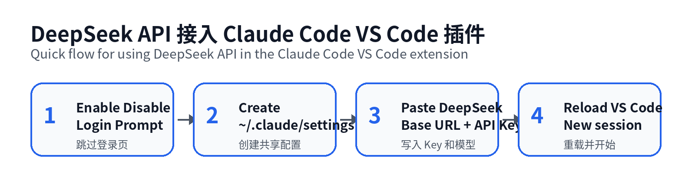
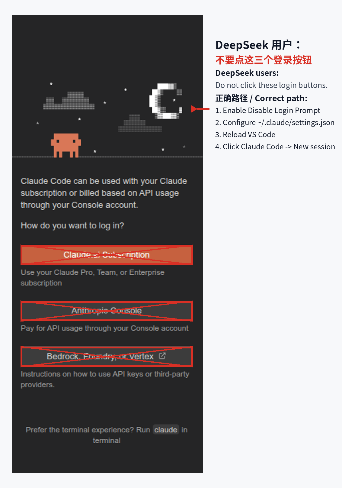
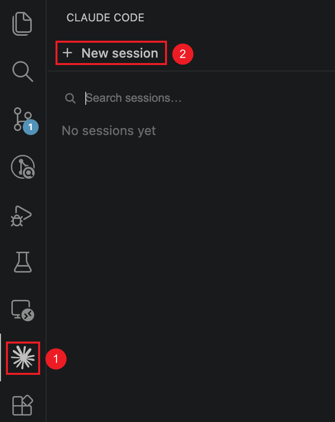

# DeepSeek API 接入 Claude Code VS Code 插件

在 VS Code 的 Claude Code 插件中使用 DeepSeek API，无需 Anthropic 账号。



## 一句话总结

不要点登录页的三个按钮；开启 **Disable Login Prompt**，然后配置 `~/.claude/settings.json`。



---

## 1. VS Code 插件设置

打开 VS Code 设置：**Ctrl + ,**（Mac 是 **Cmd + ,**）。

搜索 `Claude Code login`，勾选 **Disable Login Prompt**。

```json
"claudeCode.disableLoginPrompt": true
```

## 2. 创建配置文件

**Linux / Mac：**

```bash
mkdir -p ~/.claude
nano ~/.claude/settings.json
```

**Windows：** `C:\Users\<username>\.claude\settings.json`

## 3. 粘贴配置模板

把 `<your DeepSeek API Key>` 替换成你的真实 DeepSeek API Key：

```json
{
  "$schema": "https://json.schemastore.org/claude-code-settings.json",
  "env": {
    "ANTHROPIC_BASE_URL": "https://api.deepseek.com/anthropic",
    "ANTHROPIC_AUTH_TOKEN": "<your DeepSeek API Key>",
    "ANTHROPIC_MODEL": "deepseek-v4-pro[1m]",
    "ANTHROPIC_DEFAULT_OPUS_MODEL": "deepseek-v4-pro[1m]",
    "ANTHROPIC_DEFAULT_SONNET_MODEL": "deepseek-v4-pro[1m]",
    "ANTHROPIC_DEFAULT_HAIKU_MODEL": "deepseek-v4-flash",
    "CLAUDE_CODE_DISABLE_NONESSENTIAL_TRAFFIC": "1",
    "CLAUDE_CODE_EFFORT_LEVEL": "max",
    "CLAUDE_CODE_SUBAGENT_MODEL": "deepseek-v4-flash"
  }
}
```

> ⚠️ 不要把这个文件提交到 Git，里面有你的 API Key。

## 4. 重载并开始使用

- **Ctrl + Shift + P** → `Developer: Reload Window`
- 左侧 Claude Code 图标 → **New session**



## 终端保底方案

如果插件不正常，用命令行直接跑：

```bash
npm install -g @anthropic-ai/claude-code
claude --version

cd /path/to/my-project
claude
```

## 快速排错

| 问题 | 检查 | 处理 |
|---|---|---|
| 仍是登录页 | `disableLoginPrompt` 是否为 true | 重载窗口，确认 VS Code settings.json |
| Key 报错 | `ANTHROPIC_AUTH_TOKEN` | 重新复制 DeepSeek API Key |
| New session 无响应 | 先跑 `claude` 终端版 | 确认 CLI 能正常请求 |

## 参考资料

- [DeepSeek API 文档 — 集成 Claude Code](https://api-docs.deepseek.com/guides/claude_code)
- [awesome-deepseek-agent — claude_code.md](https://github.com/deepseek-ai/awesome-deepseek-agent/blob/main/claude_code.md)
- [Claude Code 文档 — VS Code 中使用](https://docs.anthropic.com/en/docs/claude-code/ide-integrations#vs-code)
